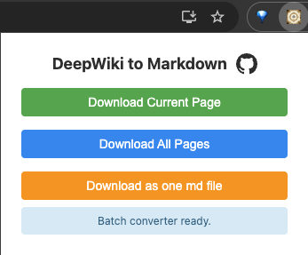

# DeepWiki 轉 Markdown 擴充功能

一個將 DeepWiki 文件頁面轉換為 Markdown 格式的 Chrome 擴充功能，方便本機編輯和存檔。

[English](./README.md) | [简体中文](./README.zh-CN.md)

## 概述

本擴充功能幫助你將 DeepWiki (https://deepwiki.com) 上的文件儲存為 Markdown 檔案。適用於：
- 建立文件的本機備份
- 離線閱讀和參考
- 將內容改編為自己的部落格或筆記
- 保存 GitHub 儲存庫的知識

## 功能特點

### 1. 單頁下載
將目前 DeepWiki 頁面轉換並下載為 Markdown 檔案。

### 2. 批次下載（ZIP 壓縮檔）
將文件專案的所有子頁面下載為獨立的 Markdown 檔案，打包到 ZIP 壓縮檔中並附帶自動產生的索引。

### 3. 單檔批次下載 ✨ 新功能
將所有文件頁面合併為一個 Markdown 檔案，方便閱讀和分享。

### 4. 進階轉換
- 保留程式碼區塊和語法突顯
- 轉換 Mermaid 圖表（流程圖、時序圖、類別圖、狀態圖）
- 保持文件結構和格式
- 處理表格、清單和巢狀內容
- 擷取後設資料（最後索引日期）

## 安裝

### 方法一：從 Chrome 線上應用程式商店安裝（推薦）

1. 造訪 [Chrome 線上應用程式商店](https://chromewebstore.google.com/detail/deepwiki-to-markdown/giidpddkhhjaikgjkkfclfidbnekghde)
2. 點選「加到 Chrome」
3. 驗證安裝 - DeepWiki 圖示應該出現在擴充功能工具列中

### 方法二：從原始碼安裝

1. **下載擴充功能**
   - 複製此儲存庫：`git clone https://github.com/philipz/deepwiki-md-chrome-extension.git`
   - 或從 [Releases](https://github.com/philipz/deepwiki-md-chrome-extension/releases) 頁面下載

2. **安裝到 Chrome**
   - 開啟 Chrome 並造訪 `chrome://extensions/`
   - 啟用「開發人員模式」（右上角開關）
   - 點選「載入未封裝項目」
   - 選擇擴充功能目錄

3. **驗證安裝**
   - DeepWiki 圖示應該出現在擴充功能工具列中
   - 造訪任意 DeepWiki 頁面進行測試

## 使用方法

### 單頁下載

1. 造訪任意 DeepWiki 文件頁面
   - 範例：[ThinkInAIXYZ/go-mcp](https://deepwiki.com/ThinkInAIXYZ/go-mcp)
2. 點選工具列中的擴充功能圖示
3. 點選 **"Download Current Page"**（下載目前頁面）
4. 選擇儲存 Markdown 檔案的位置

### 批次下載（ZIP）

1. 開啟 DeepWiki 文件專案的主頁
   - 範例：[ThinkInAIXYZ/go-mcp](https://deepwiki.com/ThinkInAIXYZ/go-mcp)
2. 點選擴充功能圖示
3. 點選 **"Download All Pages"**（下載所有頁面）
4. 等待轉換程序完成
   - 進度會顯示在彈出視窗中
   - 可隨時點選「Cancel」（取消）按鈕
5. 在提示時儲存 ZIP 檔案

**ZIP 檔案內容：**
- 每個頁面的獨立 Markdown 檔案
- 包含所有文件連結的 `README.md`
- 有組織的資料夾結構

### 單檔批次下載

1. 開啟 DeepWiki 文件專案的主頁
2. 點選擴充功能圖示
3. 點選 **"Download as one md file"**（下載為單一 md 檔案）
4. 等待所有頁面處理完成
5. 儲存合併後的 Markdown 檔案

**適用情境：**
- 建立單檔知識庫
- 匯入到筆記應用程式
- 輕鬆分享完整文件

## 範例

**轉換前（DeepWiki）：**

**轉換後（Markdown）：**

## 技術細節

- **支援網站：** https://deepwiki.com/*
- **檔案格式：** Markdown (.md)
- **編碼：** UTF-8
- **批次下載：** ZIP 壓縮檔，帶組織結構
- **圖表支援：** Mermaid 語法

## 系統需求

- Google Chrome 或基於 Chromium 的瀏覽器（Edge、Brave 等）
- 可存取 https://deepwiki.com

## 疑難排解

**擴充功能無法運作：**
- 確保你在有效的 DeepWiki 文件頁面（必須至少有 2 個路徑段：`/org/project`）
- 檢查頁面是否已完全載入
- 嘗試重新整理頁面

**下載失敗：**
- 檢查瀏覽器的下載設定
- 確保對下載資料夾有寫入權限
- 對於大批次下載，確保有足夠的磁碟空間

**批次轉換卡住：**
- 使用「Cancel」按鈕停止程序
- 重新整理頁面並重試
- 檢查瀏覽器主控台的錯誤訊息（F12 → Console）

## 開發路線圖

未來考慮的增強功能：

- [ ] 轉換前自動翻譯為其他語言
- [ ] 增強的本機儲存選項
- [ ] 雲端服務整合：
  - [ ] Google Drive（Google 雲端硬碟）
  - [ ] Microsoft OneDrive（微軟 OneDrive）
  - [ ] Notion
  - [ ] Feishu/Lark Docs（飛書文件）
- [ ] 自訂轉換範本
- [ ] 組態選項（圖表格式、後設資料包含等）
- [ ] 支援其他文件平台

## 貢獻

歡迎貢獻！你可以：
- 透過 [Issues](https://github.com/philipz/deepwiki-md-chrome-extension/issues) 回報錯誤
- 透過 [Issues](https://github.com/philipz/deepwiki-md-chrome-extension/issues) 提出功能建議
- 提交 Pull Request

## 隱私權

本擴充功能不會收集、儲存或傳輸任何個人資料。所有轉換都在您的瀏覽器本地執行。

完整詳情請參閱我們的[隱私政策](PRIVACY_POLICY.zh-TW.md)。

## 授權條款

MIT License - 詳見 [LICENSE](LICENSE) 檔案

## 致謝

- 為 [DeepWiki](https://deepwiki.com) 平台建置
- 使用 [JSZip](https://stuk.github.io/jszip/) 建立 ZIP 檔案
- 受保存和重用技術文件需求的啟發

---

**版本：** 0.1.0
**維護者：** [@philipz](https://github.com/philipz)
**儲存庫：** https://github.com/philipz/deepwiki-md-chrome-extension
